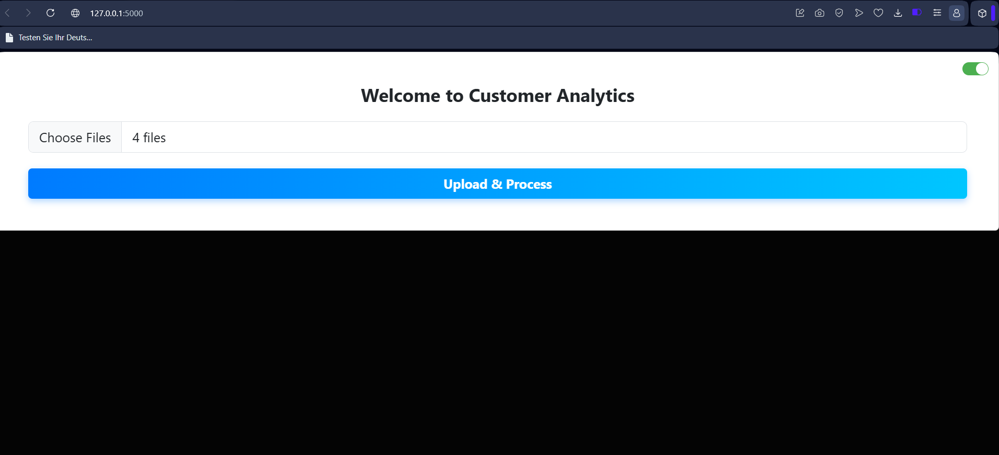
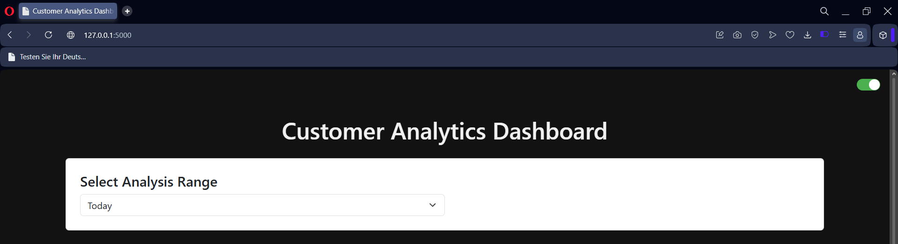
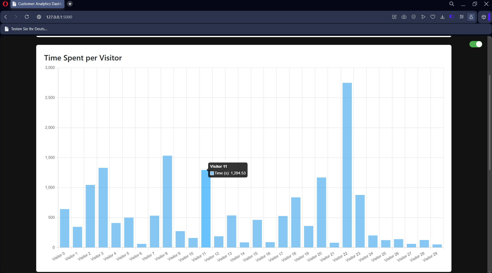
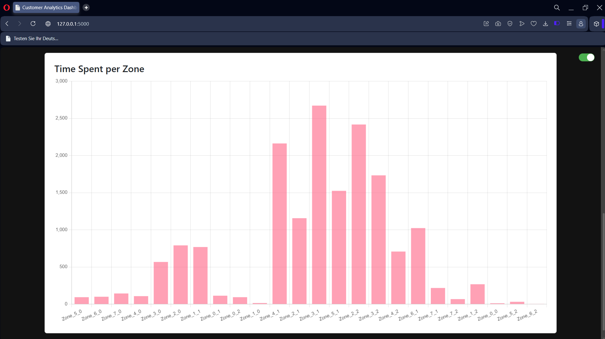
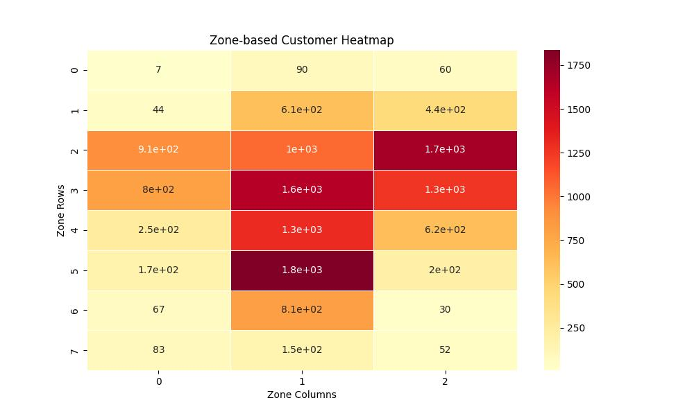

# Smart Retail Analytics System

An AI-powered retail analytics system that transforms CCTV footage into actionable customer behavior insights using computer vision and multi-camera tracking techniques.

The system detects and tracks customers across video streams, performs cross-camera customer re-identification (ReID), analyzes movement patterns, and generates analytics such as footfall, dwell time, zone popularity, and heatmaps.

---

## Problem Statement

Retail stores often use CCTV systems solely for surveillance purposes, leaving valuable customer behavior information unexplored. This project converts CCTV footage into actionable business intelligence by tracking customer movement, analyzing dwell time, identifying high-traffic zones, and generating visual analytics to support data-driven retail decisions.

---

## Dataset

This project was developed using sample CCTV-style retail video footage for academic evaluation and system validation.

The videos were used to test customer detection, tracking, cross-camera re-identification, zone-based movement analysis, and analytics generation workflows.

---

## Key Features

* Customer detection using YOLOv8
* Multi-object tracking using DeepSORT
* Cross-camera customer re-identification (ReID) using OSNet embeddings
* Visitor merging using cosine similarity and zone-path analysis
* Zone-wise movement tracking and dwell-time analysis
* Customer session recording and behavioral analytics
* Heatmap generation for store activity visualization
* Dashboard-based analytics reporting

---

## System Architecture

```text
CCTV Video Streams
        ↓
Customer Detection (YOLOv8)
        ↓
Multi-Object Tracking (DeepSORT)
        ↓
Feature Extraction (OSNet)
        ↓
Cross-Camera Re-Identification
        ↓
Visitor Merging & Identity Resolution
        ↓
Zone-Based Movement Analysis
        ↓
Analytics & Heatmap Generation
        ↓
Dashboard Visualization
```

---

## Methodology

### 1. Video Upload and Processing

Users upload one or more CCTV video streams through a Flask-based interface. Uploaded videos are passed to the analytics pipeline for processing.

### 2. Customer Detection

YOLOv8 is used to detect people in each video frame. Only person-class detections are retained for further analysis.

### 3. Multi-Object Tracking

DeepSORT assigns unique IDs to detected customers and tracks them across frames.

### 4. Zone-Based Analysis

The store is divided into predefined zones. Customer positions are mapped to zones to analyze movement patterns and dwell time.

### 5. Cross-Camera Re-Identification

OSNet feature embeddings are extracted for tracked customers. Similarity matching is used to identify the same customer across multiple camera views.

### 6. Visitor Merging

Matched visitors are merged into global identities to reduce duplicate counting and improve analytics accuracy.

### 7. Analytics Generation

Customer paths, dwell times, visitor counts, and zone statistics are aggregated.

### 8. Visualization

Heatmaps, summary reports, and dashboard charts are generated to support retail decision-making.

---

## My Contribution

This project was developed as part of a team-based Applications of AI course project.

My primary responsibility was the development of the customer re-identification (ReID) module used for cross-camera customer tracking. The ReID module was implemented in `code/reid_matcher.py`.

### Key Contributions

* Implemented cross-camera customer matching using OSNet feature embeddings and cosine similarity.
* Applied feature normalization to improve similarity comparison consistency.
* Designed a zone-path overlap validation mechanism using Jaccard similarity.
* Developed threshold-based visitor matching logic for identity resolution.
* Implemented a two-stage clustering and visitor-merging pipeline.
* Generated global customer identities across multiple camera streams.
* Reduced duplicate customer counting across different camera views.

### ReID Workflow

```text
Tracked Customer
       ↓
OSNet Feature Extraction
       ↓
Feature Vector Generation
       ↓
Cosine Similarity Matching
       ↓
Zone Overlap Validation
       ↓
Visitor Matching
       ↓
Stage 1 Merge
       ↓
Stage 2 Cluster Merge
       ↓
Global Visitor Identity
```
### ReID Matching Logic

The ReID module was designed to identify the same customer across different camera views and reduce duplicate visitor counts.

The matching process consists of the following steps:

1. Feature vectors generated using OSNet are collected for each tracked visitor.
2. Feature vectors are normalized before comparison.
3. Cosine similarity is computed between visitor embeddings.
4. Zone visitation paths are compared using Jaccard similarity.
5. Visitors are considered a match only when:
   - they originate from different cameras,
   - cosine similarity exceeds a predefined threshold,
   - zone-path overlap exceeds a predefined threshold.
6. Matched visitors are grouped into clusters representing a single customer.
7. A second-stage cluster merge is performed to further reduce fragmented identities.
8. Final merged identities are exported as global visitors for downstream analytics.
   
This hybrid approach combines appearance-based matching with movement-based validation to improve cross-camera identity resolution.

---

## Tech Stack

### Programming Language
* Python

### Computer Vision & Machine Learning
* YOLOv8
* DeepSORT
* TorchReID (OSNet)
* OpenCV
* NumPy
* Scikit-learn

### Data Analysis & Visualization
* Pandas
* Matplotlib
* Seaborn

### Web Framework
* Flask

---

## Repository Structure

```text
Smart-Retail-Analytics-System/
│
├── code/
│   ├── app.py
│   ├── analysis.py
│   ├── reid_matcher.py
│   └── index.html
│
├── screenshots/
│   ├── upload_page.png
│   ├── processing.png
│   ├── dashboard.png
│   ├── visitor_time.png
│   ├── zone_analysis.png
│   └── heatmap.jpg
│
├── Smart Retail Analytics System Project Report.pdf
└── README.md
```

---

## Results & Outputs

### Upload Interface



### Processing Stage


### Analytics Dashboard



### Visitor Time Analysis



### Zone Activity Analysis



### Zone-Based Heatmap



---

## Generated Analytics

The system generates:

* Visitor counts
* Customer dwell time analysis
* Zone-wise engagement metrics
* Customer movement paths
* Summary reports
* Store activity heatmaps
* Dashboard-based visual analytics

---

## Future Improvements

* Real-time video stream processing
* Multi-store analytics support
* Cloud-based deployment
* Live occupancy monitoring
* Advanced customer behavior prediction
* Fine-tuned person re-identification models

---

## Project Information

* Academic team project developed as part of the Applications of AI course.
* Repository contains core implementation files and project documentation.
* Full implementation details, screenshots, and project documentation are available in `Smart Retail Analytics System Project Report.pdf`.
